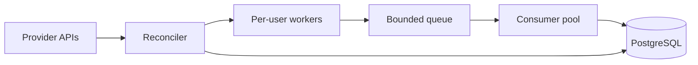

# Architecture



- Reconciler fetches current users and manages worker lifecycle.
- Workers poll emails independently; slow users do not block others.
- Queue provides backpressure boundary.
- Consumers persist and dedupe email events.

## Activity Diagram

```mermaid
flowchart TD
  A([Start cmd/discovery.k]) --> B[Load config]
  B --> C[Discovery.start(cfg)]
  C --> D[Init state, queue, DB]
  D --> E[Start consumer pool]
  E --> F[Start reconciler loop]
  F --> G[Start signal watcher task]

  subgraph R[Reconciler Loop]
    R1{running?} -->|yes| R2[Fetch provider users]
    R2 --> R3{fetch ok?}
    R3 -->|no| R4[Log provider error]
    R4 --> R5[Sleep sync_interval]
    R3 -->|yes| R6[Reconcile active workers]
    R6 --> R7[Start new user workers]
    R6 --> R8[Stop removed user workers]
    R7 --> R5
    R8 --> R5
    R5 --> R1
  end

  subgraph W[Per-user Worker Loop]
    W1{worker running?} -->|yes| W2[Fetch user emails since checkpoint]
    W2 --> W3{fetch ok?}
    W3 -->|no| W4[Log fetch error + backoff]
    W4 --> W1
    W3 -->|yes| W5[Enqueue emails into bounded queue]
    W5 --> W6[Update last check/received markers]
    W6 --> W7[Sleep poll interval]
    W7 --> W1
  end

  subgraph Cn[Consumer Pool]
    C1[Recv email event from queue] --> C2[Upsert email]
    C2 --> C3[Link user_email]
    C3 --> C4{DB error?}
    C4 -->|yes| C5[Log and continue]
    C4 -->|no| C6[Update stats]
    C5 --> C1
    C6 --> C1
  end

  subgraph S[Shutdown Path]
    S1[Wait SIGINT/SIGTERM] --> S2[Discovery.stop(app)]
    S2 --> S3[Stop reconciler]
    S3 --> S4[Stop all workers]
    S4 --> S5[Close queue]
    S5 --> S6[Wait consumer tasks]
    S6 --> S7([Exit])
  end

  F --> R1
  R7 --> W1
  W5 --> C1
  G --> S1
```
