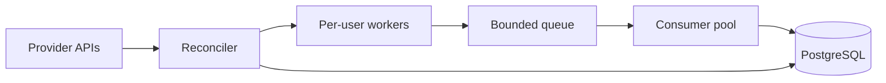

# Architecture

- Reconciler fetches current users and manages worker lifecycle.
- Workers poll emails independently; slow users do not block others.
- Queue provides backpressure boundary.
- Consumers persist and dedupe email events.
